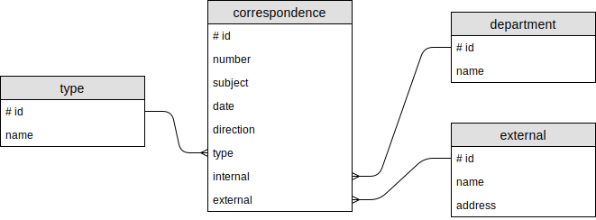

### Задание

Спроектировать модель базы данных информационной системы согласно поставленной задаче.

**Автоматизация канцелярской деятельности учреждения. Модуль «Внешняя корреспонденция».**

Канцелярия учреждения организует документооборот входящей, исходящей, внутренней организационно - распорядительной документации. К корреспонденции относятся **письма, телеграммы, факсы, электронные письма**. На каждый документ может быть заведена регистрационная карточка. В канцелярии поддерживается справочник подразделений учреждения и справочник организаций, с которыми ведется переписка. По указанию руководства периодически анализируется интенсивность документооборота (количество документов за определенный период или по определенному адресу).

Один из сотрудников регистрирует внешнюю корреспонденцию в специальном журнале и передает ее по назначению.

Программное обеспечение этого сотрудника должно позволять:
* хранить необходимую информацию о каждом виде внешней корреспонденции;
* хранить справочник подразделений предприятия и справочник внешних корреспондентов;
* автоматизировать обработку информации при следующих операциях:
    * регистрация корреспонденции (ввод данных об отправленных и пришедших письмах и пр.);
    * ведение справочника внешних корреспондентов (ввод и коррекция данных);
    * анализ интенсивности документооборота (формирование типовых диаграмм и отчетов).

Концептуальная модель данных:

